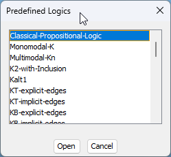

# Predefined Logics

LoTREC includes 38 predefined logic definitions ready for use. This page provides an overview of the available logics.

## Accessing Predefined Logics

1. Launch LoTREC
2. In the Task Pane, click **"Others..."** under "Open Predefined Logic"
3. Or go to **Logic → Open Predefined Logic**



## Logic Categories

### Classical Logic

| Logic | Description |
|-------|-------------|
| **Classical-Propositional-Logic** | Classical Propositional Logic |

### Basic Modal Logics

| Logic | Description |
|-------|-------------|
| **Monomodal-K** | Modal logic K (after Saul Kripke) |
| **Multimodal-Kn** | Multi-modal logic Kn: modal operators are parametrized by the agent index i. [i]Φ means Φ is necessarily true for agent i |
| **KMinimal** | The basic modal logic K: minimal set of operators (not, and, nec) with default Kripke semantics |
| **K+Universal** | The basic modal logic K with [U] and ⟨U⟩ universal modality operators |

### Modal Logics with Axiom T (Reflexivity)

| Logic | Description |
|-------|-------------|
| **KT-explicit-edges** | Modal logic K with axiom T (Reflexivity) whose semantics are explicitly handled by making the accessibility relation reflexive |
| **KT-implicit-edges** | Modal logic K with axiom T (Reflexivity) whose semantics are implicitly handled through propagation rules, without making the accessibility relation reflexive |

### Modal Logics with Axiom B (Symmetry)

| Logic | Description |
|-------|-------------|
| **KB-explicit-edges** | Modal logic K with axiom B and semantics explicitly handled by making the accessibility relation reflexive and symmetric |
| **KB-implicit-edges** | Modal logic K with axiom B where the semantics are implicitly handled through the propagation rules, without making the accessibility relation reflexive and symmetric |
| **KB5** | Modal logic KB5 with axioms B and 5 (Symmetry and Euclideanity) semantics |
| **KBD** | Modal Logic KBD with axioms B and D (Symmetry and Seriality) semantics |
| **KBT** | Modal logic KBT with axioms B and T (Symmetry and Reflexivity) semantics |

### Modal Logics with Axiom 4 (Transitivity)

| Logic | Description |
|-------|-------------|
| **K4-explicit-edges** | Modal logic K4 where the semantics of axiom 4 are explicitly handled with transitive accessibility relation |
| **K4-implicit-edges** | Modal logic K4 where the semantics of axiom 4 are implicitly handled within the propagation rules, without making the accessibility relation transitive |
| **K4Confluence** | K4 + Confluence. This version implements the optimized algorithm of Gasquet and Farinas 1999 |
| **K45Optimal** | K45 optimized version with one-depth graph. Requires conjoining a special constant "Root" to the formula |

### Modal Logics with Axiom 5 (Euclideanity)

| Logic | Description |
|-------|-------------|
| **K5** | Modal Logic K5 with axiom 5 (Euclideanity) semantics |

### Modal Logics with Axiom D (Seriality)

| Logic | Description |
|-------|-------------|
| **KD** | Modal logic K with axiom D (Seriality) semantics |
| **KD45** | KD45 logic. Requires adding the constant Root to the tested formula (e.g., "and Root nec P") |
| **KD45Optimal** | KD45 optimized version with one-depth graph. Requires conjoining the constant Root to the formula |

### Modal Logics with Other Frame Conditions

| Logic | Description |
|-------|-------------|
| **Kalt1** | Modal logic KAlt1 with axiom alt1: ¬□φ → □¬φ |
| **KConfluence** | Modal logic K with Confluence axiom (if wRu and wRv then there exists x such that uRx and vRx) |

### S4 Family (Reflexive + Transitive)

| Logic | Description |
|-------|-------------|
| **S4-Explicit-R** | S4 with all connectors. Optimal implementation using cut rules |
| **S4-with-history** | Modal logic S4 (also known as KT4): axiom K + T (reflexivity) + 4 (transitivity) with loop detection |
| **S4Minimal** | S4 with the minimal set of connectors: not, and, nec |
| **S4Optimal** | Modal logic S4 (also known as KT4): axiom K + T (reflexivity) + 4 (transitivity) |

### S5 Family (Equivalence Relations)

| Logic | Description |
|-------|-------------|
| **S5-explicit-edges** | Modal logic S5 (axioms K, T, and 5). Semantics are explicitly handled by making the accessibility relation an equivalence relation (reflexive, transitive, and symmetric) |
| **S5-implicit-edges** | Modal logic S5 (axioms K, T, and 5). Semantics are implicitly handled in the propagation rules by simulating an equivalence relation |
| **Multi-S5-PAL** | Multi-modal logic S5 with Public Announcement Logic (PAL) operators |

### Multi-Modal Logics with Inclusion

| Logic | Description |
|-------|-------------|
| **K2-with-Inclusion** | The multi-modal logic Kn with inclusion. Showcased on K2 with inclusion between the two modalities J and I |

### Intuitionistic Logics

| Logic | Description |
|-------|-------------|
| **Intuitionistic-Logic-Lj** | Intuitionistic Logic |
| **LJminimal** | Intuitionistic logic LJ (without negation) |

### Temporal Logics

| Logic | Description |
|-------|-------------|
| **LTL** | Linear-time Temporal Logic (LTL) with operators: ⟨⟩ (eventually), [] (always), X (next), U (until) |

### Dynamic Logics

| Logic | Description |
|-------|-------------|
| **PDL** | Propositional Dynamic Logic with sequence, union, and star (lacks test). Uses loop detection and model-checking post-processing |

### Hybrid Logics

| Logic | Description |
|-------|-------------|
| **Hybrid-Logic-H-at** | Hybrid Logic H with the @ operator |

### Agency Logics

| Logic | Description |
|-------|-------------|
| **xstit** | STIT logic with the next operator X |

### Model Checking

| Logic | Description |
|-------|-------------|
| **Model-Checking-Monomodal** | Model Checking for Monomodal Logic K |
| **Model-Checking-Multimodal** | Model Checking for Multimodal Logic K |

## Logic File Locations

All predefined logic files are located in:
```
src/lotrec/logics/
```

You can study these XML files to understand how logics are defined and use them as templates for your own logics.

## Modal Logic Quick Reference

### Common Axioms

| Name | Axiom | Meaning |
|------|-------|---------|
| **K** | □(P → Q) → (□P → □Q) | Distribution axiom |
| **T** | □P → P | Reflexivity |
| **4** | □P → □□P | Transitivity |
| **5** | ◇P → □◇P | Euclidean property |
| **B** | P → □◇P | Symmetry |
| **D** | □P → ◇P | Seriality |

### Frame Correspondences

| Axiom | Frame Property |
|-------|----------------|
| T | ∀w: wRw (reflexive) |
| 4 | ∀w,v,u: (wRv ∧ vRu) → wRu (transitive) |
| 5 | ∀w,v,u: (wRv ∧ wRu) → vRu (Euclidean) |
| B | ∀w,v: wRv → vRw (symmetric) |
| D | ∀w∃v: wRv (serial) |

### Named Systems

| System | Axioms | Also Known As |
|--------|--------|---------------|
| K | K | Basic modal logic |
| T | K + T | Reflexive modal logic |
| K4 | K + 4 | Transitive modal logic |
| S4 | K + T + 4 | Reflexive-transitive |
| S5 | K + T + 5 | Equivalence-based |
| KD45 | K + D + 4 + 5 | Doxastic logic (belief) |

## Using Predefined Logics

### Quick Start

1. Open **Monomodal-K** for basic modal logic experiments
2. Use the **Predefined Formulas** tab to test sample formulas
3. Click **Build Premodels** to see the tableau proof

### Testing Validity

To check if a formula φ is valid:
1. Enter `not φ` (the negation)
2. Build premodels
3. If all premodels are closed → φ is valid
4. If any premodel is open → φ is not valid

### Comparing Logics

Test the same formula in different logics to see how frame conditions affect satisfiability:

| Formula | K | KT | S4 | S5 |
|---------|---|----|----|-----|
| `□P → P` | SAT | VALID | VALID | VALID |
| `□P → □□P` | SAT | SAT | VALID | VALID |
| `◇P → □◇P` | SAT | SAT | SAT | VALID |

## Creating Variations

To create a variation of a predefined logic:

1. Open the predefined logic
2. **Logic → Save Logic As** with a new name
3. Modify connectors, rules, or strategies
4. Save your changes

## Further Reading

- [Defining Logics](defining-logics.md) - Create your own logics
- [User Guide](user-guide.md) - Complete interface reference
- [Getting Started](getting-started.md) - Installation and first proof
