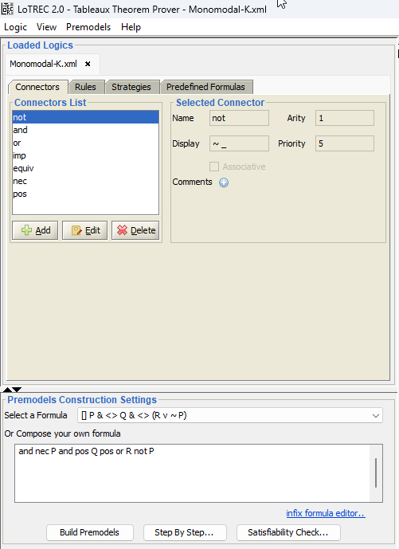
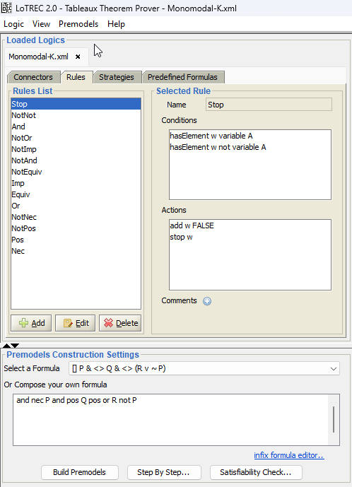
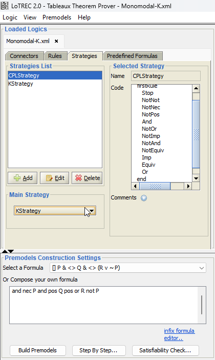
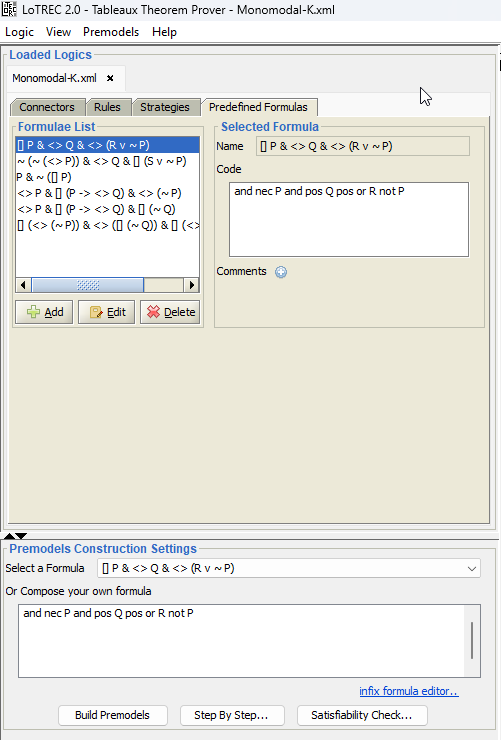
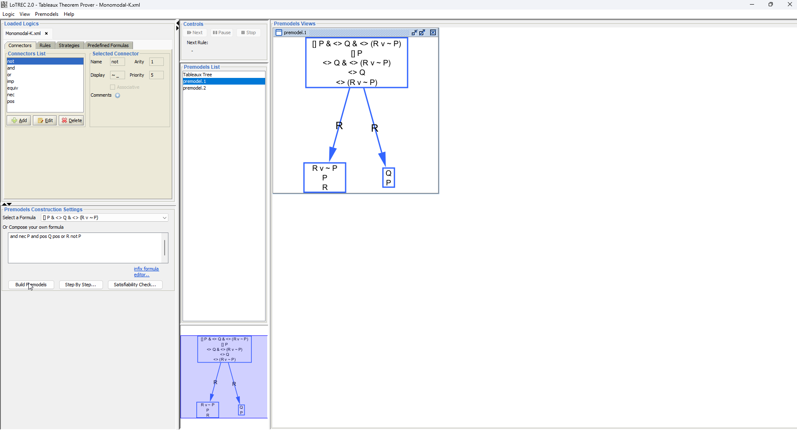

# User Guide

This guide provides a complete reference for the LoTREC interface.

## Main Window Overview



The main window is divided into several areas:

| Area | Purpose |
|------|---------|
| **Menu Bar** | File operations, view settings, proof commands |
| **Loaded Logics Panel** | Shows open logic files (tabs for multiple logics) |
| **Logic Editor** | Four tabs for editing connectors, rules, strategies, formulas |
| **Controls Panel** | Proof execution controls (Next, Pause, Stop) |
| **Premodels List** | Lists generated tableaux/premodels |
| **Premodels View** | Graph visualization of selected premodel |
| **Construction Settings** | Formula input and proof options |

## Menu Reference

### Logic Menu

| Command | Description |
|---------|-------------|
| New Logic | Create a new empty logic definition |
| Open Logic File | Load a logic from XML file |
| Open Predefined Logic | Choose from 38 built-in logics |
| Save Logic | Save current logic to file |
| Save Logic As | Save with a new filename |
| Close Logic | Close the current logic |

### View Menu

| Command | Description |
|---------|-------------|
| Show/Hide Controls | Toggle the proof controls panel |
| Show/Hide Premodels List | Toggle the premodels list |
| Premodels Display Mode | Choose graph layout options |

### Premodels Menu

| Command | Description |
|---------|-------------|
| Build Premodels | Run full proof construction |
| Step By Step | Run with debugging controls |
| Satisfiability Check | Configure checking options |
| Filter Displayed | Filter which premodels to show |

### Help Menu

| Command | Description |
|---------|-------------|
| About | Version and credits |
| Run Info | Statistics about the last proof run |

## Logic Editor Tabs

### Connectors Tab


Defines the logical operators available in your logic.

| Field | Description |
|-------|-------------|
| **Name** | Connector identifier (e.g., `not`, `and`, `nec`) |
| **Arity** | Number of arguments (1 for unary, 2 for binary) |
| **Display** | Output format (`~_` shows as `~P` for `not P`) |
| **Priority** | Parsing precedence (higher = tighter binding) |
| **Associative** | Whether the operator is associative |

**Adding a Connector:**
1. Click **Add**
2. Choose from predefined list or enter custom values
3. Click **OK**


### Rules Tab



Defines the inference rules that decompose formulas.

Each rule consists of:
- **Conditions** - When the rule applies
- **Actions** - What the rule does

**Adding a Rule:**
1. Click **Add** to create a new rule
2. Add conditions (e.g., "hasElement", "isAtomic")
3. Add actions (e.g., "add", "createNewNode", "link")


### Strategies Tab



Controls the order in which rules are applied.

**Strategy constructs:**
- `repeat ... end` - Loop until no rule applies
- `firstRule ... end` - Apply first matching rule only
- `allRules ... end` - Apply all matching rules

**Example:**
```
repeat
  firstRule
    RuleAnd
    RuleOr
    RuleNec
  end
end
```

### Predefined Formulas Tab



Sample formulas for testing the logic.

Use these to:
- Verify your logic definition works correctly
- Provide examples for users of your logic

## Proof Construction

### Building Premodels

1. Select or enter a formula in **Construction Settings**
2. Click **Build Premodels**
3. View results in the **Premodels View**



### Understanding Results

| Element | Meaning |
|---------|---------|
| **Nodes** | Possible worlds in the Kripke model |
| **Edges** | Accessibility relations between worlds |
| **Labels** | Formulas true at each world |
| **Tableaux Tree** | Shows branching structure of the proof |

### Step-by-Step Mode


For detailed debugging:

1. Click **Step By Step...**
2. Set breakpoints on specific rules
3. Use **Next** to advance one step
4. Use **Pause** to stop automatic execution
5. Use **Stop** to terminate

### Satisfiability Check


Configure checking options:
- **Find all models** vs **Stop at first**
- **Timeout** settings
- **Memory limits**

## Working with Multiple Logics

You can open multiple logics simultaneously:
- Each appears as a tab in the **Loaded Logics** panel
- Click tabs to switch between logics
- Close tabs with the **×** button

## Formula Syntax

LoTREC uses **prefix notation** internally:

| Infix | Prefix | Meaning |
|-------|--------|---------|
| `P ∧ Q` | `and P Q` | Conjunction |
| `P ∨ Q` | `or P Q` | Disjunction |
| `¬P` | `not P` | Negation |
| `P → Q` | `imp P Q` | Implication |
| `□P` | `nec P` | Necessity |
| `◇P` | `pos P` | Possibility |

**Nested formulas:**
- `□(P ∧ Q)` becomes `nec and P Q`
- `◇¬P ∨ □Q` becomes `or pos not P nec Q`

## Keyboard Shortcuts

| Shortcut | Action |
|----------|--------|
| `Ctrl+O` | Open logic file |
| `Ctrl+S` | Save logic |
| `Ctrl+N` | New logic |
| `F5` | Build premodels |

## Tips and Best Practices

1. **Start with predefined logics** to understand the system
2. **Use step-by-step mode** when debugging rules
3. **Check the Run Info** (Help menu) for performance statistics
4. **Increase memory** for complex proofs
5. **Save frequently** when editing logic definitions

## Further Reading

- [Getting Started](getting-started.md) - Installation and your first proof
- [Defining Logics](defining-logics.md) - Create custom logics with XML rules
- [Predefined Logics](predefined-logics.md) - Overview of 38 built-in logics